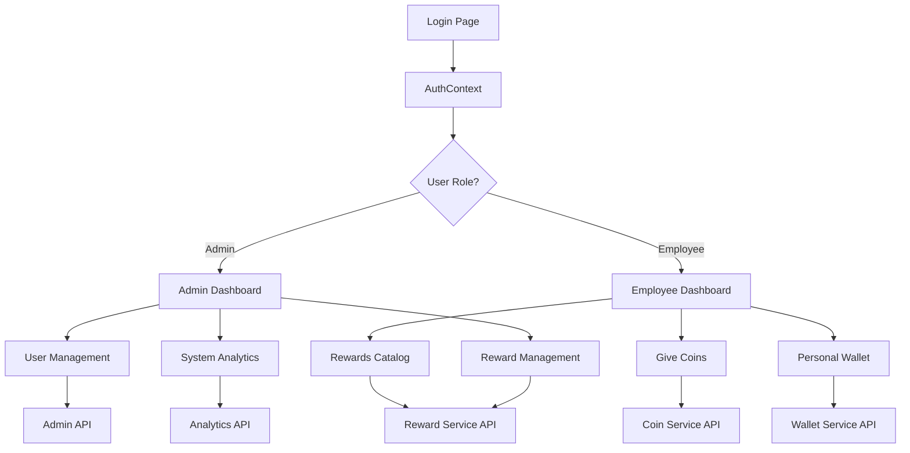

# D-Wallet Digital Wallet Platform - Component Workflow Mapping

## 📋 Table of Contents
1. [User Action Mapping](#user-action-mapping)
2. [Component Action Mapping](#component-action-mapping)
3. [Page Flow Mapping](#page-flow-mapping)
4. [API Endpoint Mapping](#api-endpoint-mapping)
5. [State Management Mapping](#state-management-mapping)
6. [Authentication & Authorization Flow](#authentication--authorization-flow)

---

## 1. User Action Mapping

### 👤 **Employee User Actions**

| Action | Trigger | Component | Result | API Call |
|--------|---------|-----------|--------|----------|
| **Login** | Form submission | `LoginPage` | Redirect to employee dashboard | `POST /api/auth/login` |
| **View Dashboard** | Page load | `EmployeeDashboard` | Display stats, recent transactions | `userService.getCurrentUser()`, `walletService.getUserWallet()` |
| **Give Coins** | Button click | `GiveCoinsPage` | Navigate to coin giving form | - |
| **Search Employee** | Input change | `GiveCoinsPage` | Find recipient by employee ID | `userService.searchUserByEmployeeId()` |
| **Send Coins** | Form submission | `GiveCoinsPage` | Transfer coins with message | `coinService.sendCoins()` |
| **View Wallet** | Navigation | `PersonalWalletPage` | Show balance and transactions | `walletService.getUserWallet()` |
| **Filter Transactions** | Tab click | `PersonalWalletPage` | Filter by type (all/received/redeemed) | Local state update |
| **View Rewards** | Navigation | `RewardsPage` | Browse available rewards | `rewardService.getAllRewards()` |
| **Redeem Reward** | Button click | `RewardsPage` | Exchange points for reward | `rewardService.redeemReward()` |
| **Logout** | Menu click | `Navbar` | Clear session, redirect to login | `POST /api/auth/logout` |

### 👨‍💼 **Admin User Actions**

| Action | Trigger | Component | Result | API Call |
|--------|---------|-----------|--------|----------|
| **Login** | Form submission | `LoginPage` | Redirect to admin dashboard | `POST /api/auth/login` |
| **View Admin Dashboard** | Page load | `AdminDashboard` | Display system analytics | `analyticsService.getAnalyticsData()` |
| **Manage Users** | Button click | `AdminDashboard` | Navigate to user management | `GET /api/admin/users` |
| **View System Stats** | Dashboard load | `AdminDashboard` | Show platform metrics | `analyticsService.getAnalyticsData()` |
| **Manage Rewards** | Button click | `AdminDashboard` | Navigate to reward management | `rewardService.getAllRewards()` |
| **View Analytics** | Button click | `AdminDashboard` | Display detailed reports | `analyticsService.getAnalyticsData()` |
| **System Settings** | Button click | `AdminDashboard` | Access configuration panel | `GET /api/admin/system/memory` |
| **Give Coins (Admin)** | Navigation | `GiveCoinsPage` | Same as employee with admin privileges | `coinService.sendCoins()` |
| **View All Wallets** | Admin panel | `AdminDashboard` | Monitor all user balances | `GET /api/admin/users` |

---

## 2. Component Action Mapping

### 🔐 **Authentication Components**

#### `LoginPage` (`/login`)
- **Email Input**: Updates local state, validates format
- **Password Input**: Updates local state, toggles visibility
- **Show/Hide Password**: Toggles password visibility state
- **Login Button**: Submits form → `AuthContext.login()` → `POST /api/auth/login`
- **Demo Credentials**: Pre-fills form with demo values

#### `AuthContext`
- **login()**: Authenticates user, sets session, updates global state
- **logout()**: Clears session, redirects to login
- **checkAuth()**: Validates existing session on app load

### 🏠 **Dashboard Components**

#### `EmployeeDashboard` (`/dashboard/employee`)
- **Quick Actions - Give Coins**: Navigate to `/dashboard/give-coins`
- **Quick Actions - View Rewards**: Navigate to `/dashboard/rewards`
- **Wallet Card**: Navigate to `/dashboard/wallet`
- **Recent Transactions**: Display last 3 transactions
- **Leaderboard**: Show top 3 performers
- **FAB (Give Coins)**: Quick access to coin giving

#### `AdminDashboard` (`/dashboard/admin`)
- **System Stats Cards**: Display real-time metrics
- **Quick Actions - Add User**: Navigate to user management
- **Quick Actions - Manage Rewards**: Navigate to reward management
- **Quick Actions - View Analytics**: Navigate to analytics
- **Quick Actions - System Settings**: Navigate to settings
- **Analytics Charts**: Interactive data visualization

### 💰 **Transaction Components**

#### `GiveCoinsPage` (`/dashboard/give-coins`)
- **Back Button**: Navigate to previous page
- **Employee ID Input**: Search for recipient
- **Amount Selection**: Choose coin amount (5, 10, 15, 25, custom)
- **Custom Amount Input**: Enter specific amount
- **Message Input**: Add appreciation message
- **Anonymous Toggle**: Hide sender identity
- **Send Button**: Submit transaction → `coinService.sendCoins()`

#### `PersonalWalletPage` (`/dashboard/wallet`)
- **Back Button**: Navigate to previous page
- **Filter Tabs**: Switch between All/Received/Redeemed
- **Transaction History**: Grouped by date (Today, Yesterday)
- **Transaction Cards**: Show details with sender/receiver info

### 🎁 **Reward Components**

#### `RewardsPage` (`/dashboard/rewards`)
- **Category Filters**: Filter rewards by category
- **Reward Cards**: Display available rewards
- **Redeem Button**: Exchange points for reward
- **Point Balance**: Show available points

### 🧭 **Navigation Components**

#### `Navbar`
- **Logo**: Navigate to dashboard home
- **User Dropdown**: Access profile and logout
- **Logout**: Clear session and redirect

#### `BottomNavigation`
- **Home**: Navigate to dashboard
- **Give**: Navigate to give coins
- **Rewards**: Navigate to rewards
- **Profile**: Navigate to profile/wallet

---

## 3. Page Flow Mapping

### 🔄 **Authentication Flow**
```
/ (Root) → Check Auth State
├── Authenticated → /dashboard → Role-based redirect
│   ├── Admin → /dashboard/admin
│   └── Employee → /dashboard/employee
└── Not Authenticated → /login
```

### 👤 **Employee User Flow**
```
/login → /dashboard/employee
├── Give Coins → /dashboard/give-coins
│   ├── Search Employee → API Call
│   ├── Select Amount → Local State
│   ├── Add Message → Local State
│   └── Send → API Call → Success/Error
├── View Wallet → /dashboard/wallet
│   ├── Filter Transactions → Local State
│   └── View History → Grouped Display
├── View Rewards → /dashboard/rewards
│   ├── Browse Catalog → API Call
│   └── Redeem → API Call → Confirmation
└── Logout → /login
```

### 👨‍💼 **Admin User Flow**
```
/login → /dashboard/admin
├── System Overview → Analytics Display
├── User Management → /admin/users
├── Reward Management → /admin/rewards
├── Analytics → /admin/analytics
├── System Settings → /admin/settings
├── Give Coins → /dashboard/give-coins (same as employee)
└── Logout → /login
```

### 🔒 **Route Protection**
- **Public Routes**: `/`, `/login`
- **Protected Routes**: All `/dashboard/*` routes
- **Admin Only**: `/dashboard/admin`, `/api/admin/*`
- **Employee Access**: `/dashboard/employee`, `/dashboard/give-coins`, `/dashboard/wallet`, `/dashboard/rewards`

---

## 4. API Endpoint Mapping

### 🔐 **Authentication Endpoints**

| Endpoint | Method | Purpose | Auth Required | Admin Only |
|----------|--------|---------|---------------|------------|
| `/api/auth/login` | POST | User authentication | ❌ | ❌ |
| `/api/auth/logout` | POST | Session termination | ✅ | ❌ |
| `/api/auth/me` | GET | Current user info | ✅ | ❌ |

### 👥 **User Management Endpoints**

| Endpoint | Method | Purpose | Auth Required | Admin Only |
|----------|--------|---------|---------------|------------|
| `/api/admin/users` | GET | List all users | ✅ | ✅ |
| `/api/admin/users/[id]` | GET | Get user details | ✅ | ✅ |
| `/api/admin/users` | POST | Create new user | ✅ | ✅ |
| `/api/admin/users/[id]` | PUT | Update user | ✅ | ✅ |
| `/api/admin/users/[id]` | DELETE | Delete user | ✅ | ✅ |

### 🏛️ **Admin System Endpoints**

| Endpoint | Method | Purpose | Auth Required | Admin Only |
|----------|--------|---------|---------------|------------|
| `/api/admin/roles` | GET | List roles | ✅ | ✅ |
| `/api/admin/roles` | POST | Create role | ✅ | ✅ |
| `/api/admin/permissions` | GET | List permissions | ✅ | ✅ |
| `/api/admin/system/memory` | GET | Memory stats | ✅ | ✅ |
| `/api/admin/system/memory` | POST | Memory cleanup | ✅ | ✅ |

### 🎯 **Mock Service Endpoints**

| Service | Method | Purpose | Component Usage |
|---------|--------|---------|-----------------|
| `userService.getCurrentUser()` | GET | Current user data | All dashboard pages |
| `userService.searchUserByEmployeeId()` | GET | Find user by ID | Give coins page |
| `coinService.sendCoins()` | POST | Transfer coins | Give coins page |
| `coinService.getTransactionHistory()` | GET | User transactions | Wallet page |
| `walletService.getUserWallet()` | GET | Wallet balance | Dashboard, wallet |
| `rewardService.getAllRewards()` | GET | Available rewards | Rewards page |
| `rewardService.redeemReward()` | POST | Redeem reward | Rewards page |
| `analyticsService.getAnalyticsData()` | GET | Platform metrics | Admin dashboard |
| `analyticsService.getLeaderboard()` | GET | Top performers | Employee dashboard |

---

## 5. State Management Mapping

### 🌐 **Global State (AuthContext)**

| State | Type | Purpose | Updated By | Used By |
|-------|------|---------|------------|---------|
| `user` | User \| null | Current authenticated user | login/logout | All components |
| `isLoading` | boolean | Auth check status | checkAuth | Loading screens |
| `csrfToken` | string \| null | CSRF protection token | login | API calls |

### 📱 **Local Component State**

#### `LoginPage`
- `email`: string - Login email
- `password`: string - Login password  
- `showPassword`: boolean - Password visibility
- `isLoading`: boolean - Form submission state
- `error`: string - Error messages

#### `GiveCoinsPage`
- `selectedEmployee`: User | null - Coin recipient
- `employeeId`: string - Search input
- `selectedAmount`: number - Coin amount
- `customAmount`: string - Custom amount input
- `message`: string - Appreciation message
- `isAnonymous`: boolean - Anonymous sending
- `loading`: boolean - Page loading state
- `searching`: boolean - Employee search state
- `sending`: boolean - Transaction state

#### `PersonalWalletPage`
- `user`: User | null - Current user
- `wallet`: UserWallet | null - Wallet data
- `loading`: boolean - Page loading state
- `filter`: 'all' | 'received' | 'redeemed' - Transaction filter

#### `AdminDashboard`
- `user`: User | null - Current admin
- `analytics`: AnalyticsData | null - System metrics
- `loading`: boolean - Data loading state

#### `EmployeeDashboard`
- `user`: User | null - Current user
- `wallet`: UserWallet | null - Wallet data
- `recentTransactions`: CoinTransaction[] - Recent activity
- `leaderboard`: LeaderboardEntry[] - Top performers
- `loading`: boolean - Data loading state

---

## 6. Authentication & Authorization Flow

### 🔐 **Authentication Process**
1. **Login Request**: User submits credentials
2. **Server Validation**: Verify email/password against database
3. **Session Creation**: Generate JWT token with user data
4. **Cookie Setting**: Store secure session cookie
5. **CSRF Token**: Generate and return CSRF token
6. **Client Storage**: Store user data in AuthContext
7. **Route Protection**: Middleware validates all protected routes

### 🛡️ **Authorization Levels**
- **Public**: Login page, root redirect
- **Authenticated**: All dashboard pages
- **Employee**: Standard user features
- **Admin**: System management features

### 🔄 **Session Management**
- **Token Validation**: Every API request validates JWT
- **CSRF Protection**: POST requests require CSRF token
- **Auto Logout**: Invalid sessions redirect to login
- **Session Refresh**: Automatic token renewal

### 🚪 **Route Guards**
- **AuthContext**: Provides authentication state
- **useAuth Hook**: Components check auth status
- **Middleware**: Server-side route protection
- **Role-based Routing**: Automatic dashboard redirection

---

## 📊 **Component Interaction Summary**



---

## 7. Detailed Component Specifications

### 🔧 **Interactive Elements Mapping**

#### **Button Components**
| Button | Location | Action | API Call | State Change |
|--------|----------|--------|----------|--------------|
| Login Submit | LoginPage | Authenticate user | `POST /api/auth/login` | Set user, redirect |
| Give Coins FAB | EmployeeDashboard | Quick coin giving | - | Navigate to give-coins |
| Send Coins | GiveCoinsPage | Transfer coins | `coinService.sendCoins()` | Reset form, reload data |
| Redeem Reward | RewardsPage | Exchange points | `rewardService.redeemReward()` | Update balance |
| Filter Tab | WalletPage | Filter transactions | - | Update filter state |
| Back Button | All pages | Navigate back | - | Router.back() |
| Logout | Navbar | End session | `POST /api/auth/logout` | Clear state, redirect |

#### **Form Components**
| Form | Fields | Validation | Submit Action | Error Handling |
|------|--------|------------|---------------|----------------|
| Login Form | email, password | Email format, required | AuthContext.login() | Display error message |
| Give Coins Form | employeeId, amount, message, anonymous | Required fields, amount limits | coinService.sendCoins() | Alert on error |
| Employee Search | employeeId | Required, format | userService.searchUserByEmployeeId() | Show "not found" |

#### **Navigation Elements**
| Element | Type | Destination | Condition | State Update |
|---------|------|-------------|-----------|--------------|
| Logo Click | Link | /dashboard | Authenticated | - |
| Home Tab | Button | /dashboard/employee | Employee role | Set activeNav |
| Give Tab | Button | /dashboard/give-coins | Authenticated | Set activeNav |
| Rewards Tab | Button | /dashboard/rewards | Authenticated | Set activeNav |
| Profile Tab | Button | /dashboard/wallet | Authenticated | Set activeNav |
| Admin Actions | Buttons | Various admin pages | Admin role | Navigate |

---

## 8. Error Handling & Loading States

### ⚠️ **Error Scenarios**
| Scenario | Component | Error Display | Recovery Action |
|----------|-----------|---------------|-----------------|
| Login Failed | LoginPage | Error message below form | Allow retry |
| Network Error | Any API call | Alert or toast notification | Retry button |
| Insufficient Coins | GiveCoinsPage | Alert message | Return to form |
| Employee Not Found | GiveCoinsPage | "Employee not found" message | Clear search |
| Session Expired | Any protected page | Redirect to login | Re-authenticate |
| Permission Denied | Admin pages | 403 error page | Redirect to dashboard |

### ⏳ **Loading States**
| Component | Loading Trigger | Loading UI | Completion Action |
|-----------|-----------------|------------|-------------------|
| LoginPage | Form submission | Button spinner | Redirect or error |
| Dashboard | Page load | Full page spinner | Show dashboard |
| GiveCoinsPage | Employee search | Input spinner | Show results |
| WalletPage | Transaction load | Skeleton cards | Show transactions |
| RewardsPage | Catalog load | Loading cards | Show rewards |

---

## 9. Data Flow Architecture

### 📊 **Data Sources**
```
Mock API Services
├── userService
│   ├── getCurrentUser()
│   ├── searchUserByEmployeeId()
│   └── getAllUsers()
├── coinService
│   ├── sendCoins()
│   ├── getTransactionHistory()
│   └── getUserAllocation()
├── walletService
│   └── getUserWallet()
├── rewardService
│   ├── getAllRewards()
│   └── redeemReward()
└── analyticsService
    ├── getAnalyticsData()
    └── getLeaderboard()
```

### 🔄 **State Synchronization**
- **AuthContext**: Global user state, shared across all components
- **Local State**: Component-specific data, reset on navigation
- **API Cache**: No caching implemented, fresh data on each call
- **Form State**: Controlled components with local state management

---

## 10. Security & Permissions

### 🛡️ **Permission Matrix**
| Feature | Employee | Admin | API Endpoint | Middleware |
|---------|----------|-------|--------------|------------|
| View Dashboard | ✅ | ✅ | - | withAuthorization |
| Give Coins | ✅ | ✅ | coinService.sendCoins | - |
| View Wallet | ✅ | ✅ | walletService.getUserWallet | - |
| Redeem Rewards | ✅ | ✅ | rewardService.redeemReward | - |
| View All Users | ❌ | ✅ | GET /api/admin/users | VIEW_USERS |
| Manage Roles | ❌ | ✅ | GET /api/admin/roles | VIEW_ROLES |
| System Settings | ❌ | ✅ | GET /api/admin/system/* | ADMIN_API_ACCESS |

### 🔐 **Security Measures**
- **JWT Authentication**: Secure session tokens
- **CSRF Protection**: Required for state-changing operations
- **Role-based Access**: Server-side permission validation
- **Input Validation**: Client and server-side validation
- **Rate Limiting**: Applied to login endpoint
- **Secure Headers**: Applied to all API responses

This comprehensive mapping provides developers with a complete understanding of user journeys, component interactions, API integrations, and security considerations within the D-Point peer recognition platform.
